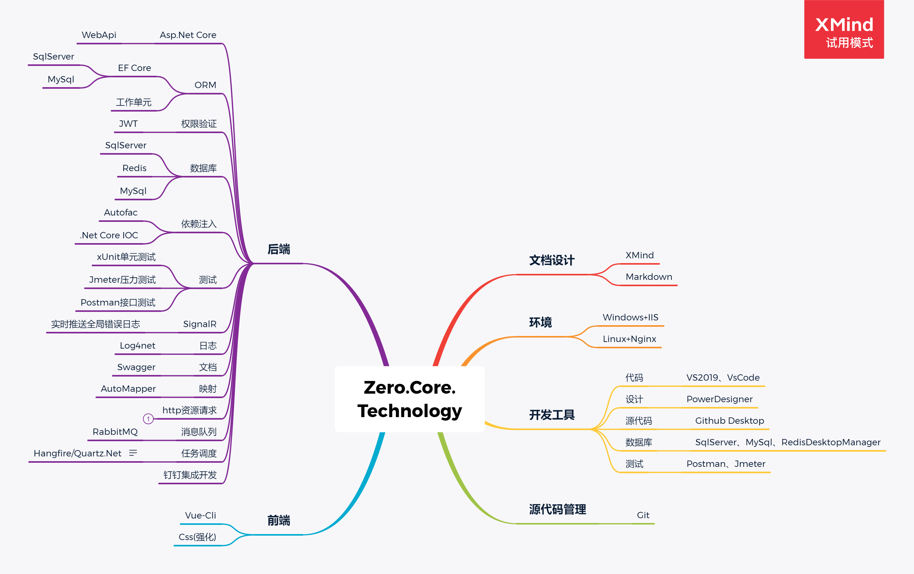
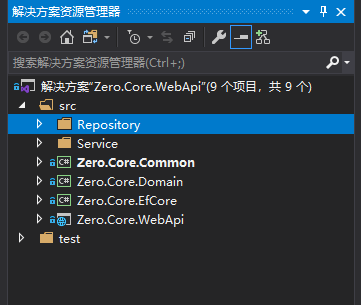
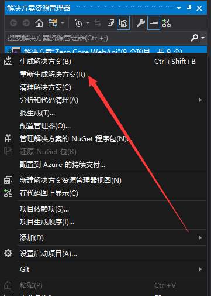
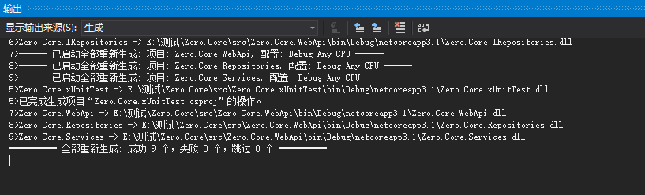
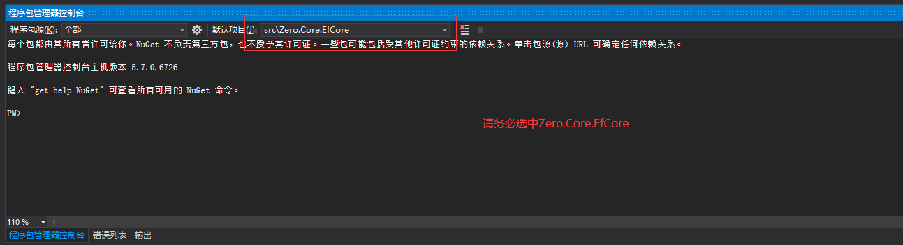
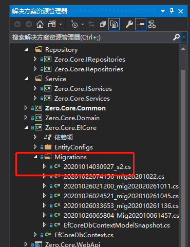
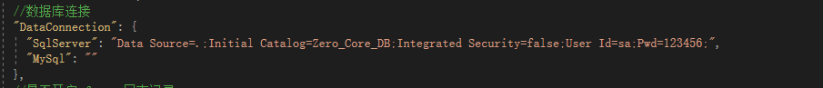
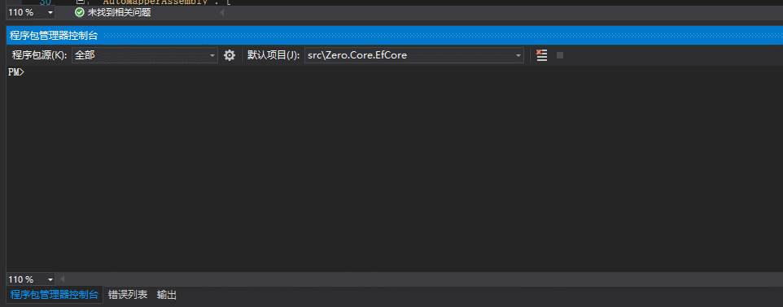
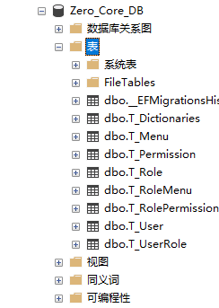
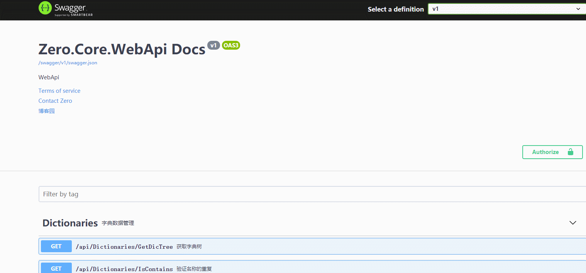

## 1.简介
>🐷 Zero.Core是一个轻量级的Asp.Net Core 业务开发框架。  
> 内置了常规的用户角色权限管理功能，开箱即用！  
> 并且会将我个人在实际业务中用到的一些比较好的案例。  
>关于这个框架其实大部分我都没有记录或者写博客，因为我写的代码中有很多的注释，基本很好明白。  
>但是我还是会将一些我个人不好理解的东西记录博客。  
>我的博客园主页:[前往](https://www.cnblogs.com/aqgy12138/)  
>当然我这个框架还是搭配了前端一起使用。  
>前端仓库:[前往](https://github.com/QQ2287991080/Zero.Core.Admin)
## 2.预览
> [预览](http://123.56.236.167:1204/)
## 3.开发  
>| **介绍** | **说明** |
>| :---- | :----|  
>|开发环境|Win10|
>|运行环境（部署）|Win10，Linux（未来一定会去做Linux的）|
>|开发工具|vs2019,SqlServer...更多请看蓝图|
>|.Net Core Sdk|[3.1.7](https://dotnet.microsoft.com/download/dotnet-core/3.1)|
>
## 4.蓝图
>对于这个框架的技术方向的整理，基本都是我未来想去学习或者已经学习了的技术，如图：  
>  
## 5.数据库设计
>数据库表设计主要为用户表、角色表、菜单表、权限表、字典数据表，同时附带的一些中间表  
>
>这个模型使用PowerDesign设计的，文件[地址](https://github.com/QQ2287991080/Zero.Core/tree/master/docs/SqlDesign) .pdm后缀名。    
>ps:*需要注意的是我的Pd的版本是16.6的，要不然是打不开的*
## 6.功能  
>✅用户管理  
>✅角色管理  
>✅权限管理  
>✅菜单管理  
>✅字典数据管理  
>✅EfCore+SqlServer  
>❎EfCore+MySql  
>✅Jwt用户权限  
>✅Redis+Jwt用户登录保护  
>✅Autofac依赖注入  
>✅SignalR实时推送全局错误日志  
>✅Log4net 记录程序日志  
>✅Swagger API接口文档  
>✅AutoMapper 数据映射  
>✅Quartz.Net任务调度  
>❎钉钉集成  
>❎Quartz同步钉钉部门和人员  
## 7.使用
>* 1.首先将代码clone下来。  
>  
>* 2.代码下载好后把打开,如图  
>
>* 3.右键解决方案->重新生成解决方案  
>  
>* 4.查看生成结果，确保没有错误  
>
>* 5.准备EfCore迁移,首先打开程序包管理控制台
>
>* 6.如果Zero.EfCore类库下有这个文件夹，请先删除  
>
>* 7.查看appsetting.json下的sql配置  
>
>* 8.启用迁移
>
>* 9.查看数据库,打开数据库，查看efcore生成的数据库  
>
>* 10.初始化数据库脚本  
>脚本文件[前往](https://github.com/QQ2287991080/Zero.Core/blob/master/docs/SqlData/dbData.sql)  
>* 11.启动程序,调试接口
>  
>成功接口说明就整个项目就跑通啦。😜  
>如果您没有安装redis,那么需要先安装redis服务。[前往](https://www.runoob.com/redis/redis-tutorial.html)  
>*如果图片未加载出来您可以前往个人博客查看使用方法。*[前往](https://www.cnblogs.com/aqgy12138/p/13976257.html)  
## 8.系列博客
>* [代码本地使用](https://www.cnblogs.com/aqgy12138/p/13976257.html)
>* Quart篇  
>   - [简单使用Quartz](https://www.cnblogs.com/aqgy12138/p/14011785.html)  
## 9.交流
>欢迎各位高手，进群友好讨论学习技术！  
>QQ群：925362372
感谢您的支持，如果您喜欢请给个Star⭐吧！（在页面的右上角！🤭）
## 10.致谢
>感谢在我开发路上给我帮助的人，谢谢你们！
## 